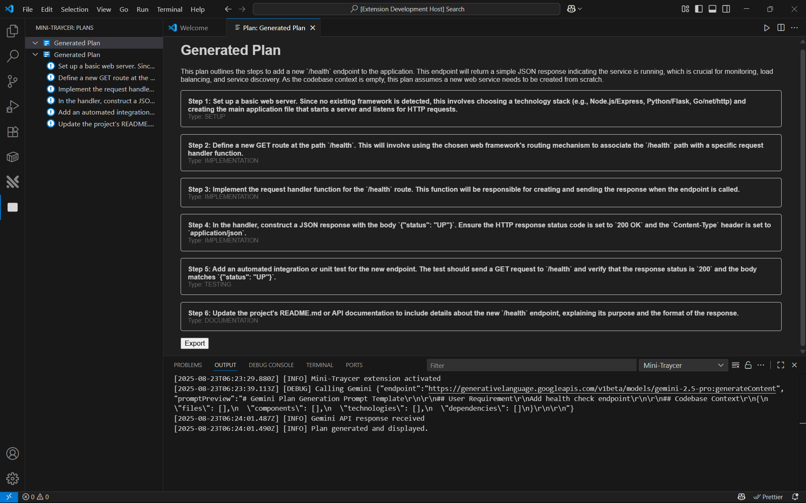
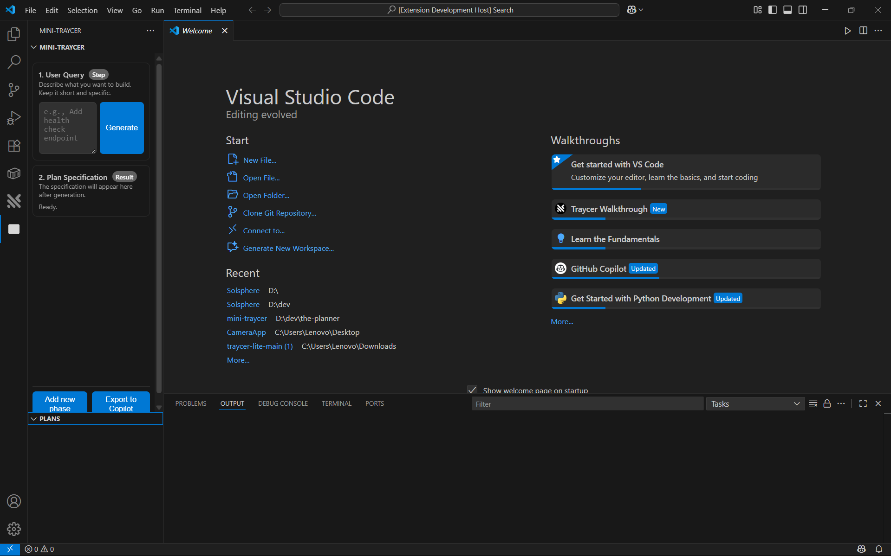
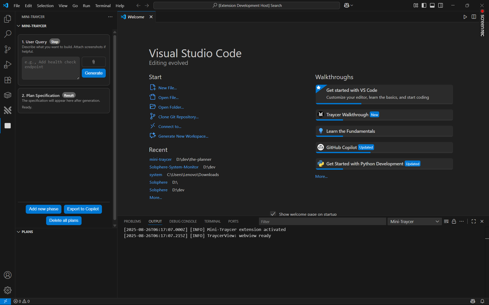

# Miycer (Mini Traycer)

A VS Code extension that acts as a planning layer for coding agents. It generates an actionable plan first, then hands off to your agent or Copilot to execute.

## What’s included

- Traycer‑like two‑step flow in the sidebar webview:
  - Step 1: User Query with inline edit.
  - Step 2: Plan Specification with typed steps and details.
- Saved Plans section inside the webview and a dedicated Plans tree view.
- Image attachments in the query (PNG/JPG/WebP/GIF) with thumbnails and remove buttons; images are sent to Gemini as inlineData.
- Robust Gemini 2.5 Pro integration with retry/backoff and helpful errors.
- Filename/title derivation from the prompt for exports.
- Exports: Markdown, JSON, Text, plus “Export to Copilot” (copies a Chat‑ready prompt and opens Copilot Chat; also attempts LM API send when available).
- “Delete All Plans” command and UI button.
- Color scheme aligned with Traycer while respecting VS Code theme tokens.
- 100% TypeScript codebase (extension + webview TS).

## Commands

- Mini‑Traycer: Create Plan
- Mini‑Traycer: Export Plan
- Mini‑Traycer: Delete All Plans
- Mini‑Traycer: Set Gemini API Key

## Configuration

- miniTraycer.geminiApiKey: Gemini API key (stored in user settings). Regex validation for AIza… keys.
- miniTraycer.geminiApiEndpoint: Defaults to Gemini 2.5 Pro generateContent.
- miniTraycer.requestTimeoutMs: HTTP timeout in ms.

## How it works

1) Codebase scan
- Shallow recursive scan of the first workspace folder (ignores node_modules/out/.git).
- Summarizes files, exported components, imports (dependencies), and a simple technologies hint.

2) Plan generation
- Builds a structured prompt including your requirement and the codebase summary.
- Calls Gemini 2.5 Pro; if no usable text returns, retries with a strict JSON‑only instruction.
- Parses JSON from fenced blocks or heuristically infers steps from plain text.
- Maps step type strings to an enum (ANALYSIS, IMPLEMENTATION, TESTING, REFACTORING, DOCUMENTATION, OTHER).

3) UI and export
- Shows a Traycer‑style plan in the sidebar, lets you add optional phases, and export.
- Saved plans persist in workspaceState and appear both in the Plans tree and in the sidebar’s Saved Plans list.

## Setup

1. Clone this repo
2. Install dependencies
   - Windows PowerShell:
     ```powershell
     npm install
     npm run compile
     ```
3. Provide a Gemini API key
   - Use the command: Mini‑Traycer: Set Gemini API Key (stored in user settings)
   - Or set env var GEMINI_API_KEY
4. Launch the Extension Development Host (Run Extension in VS Code)

## Using Mini‑Traycer

1. Open the Mini‑Traycer view from the Activity Bar.
2. Enter your task in “User Query,” optionally upload images with the paperclip, then Generate.
3. Review the “Plan Specification” result. Use inline “Edit…” to tweak the query if needed.
4. Export via Markdown/JSON/Text, or “Export to Copilot” to copy a ready‑to‑run prompt and open Copilot Chat.
5. Manage saved plans from the tree view or the in‑panel “Saved Plans” list. Use “Delete all plans” to clear.

## Bundle and install (.vsix)

Package the extension into a single .vsix that can be installed by double‑clicking.

1) Prerequisites
- Ensure `package.json` has valid `name`, `publisher`, `version`, and `engines.vscode`.
- Make sure an icon is set: `icon: resources/icons/mini-traycer.png` (128×128 PNG).

2) Install the packager
```powershell
npm i -D @vscode/vsce
```

3) Scripts (already set here)
- `vscode:prepublish` compiles TypeScript before packaging.
- `package` runs the packager.

4) Optional: exclude dev files (.vscodeignore)
```text
**/.vscode/**
**/.github/**
**/.history/**
**/out/test/**
**/*.map
**/*.tsbuildinfo
```

5) Build and package
```powershell
npm run package
```

This creates `mini-traycer-<version>.vsix` in the project root.

6) Install by clicking
- Double‑click the `.vsix` to open VS Code’s installer; confirm to install.
- Or via CLI:
```powershell
code --install-extension .\mini-traycer-0.1.0.vsix
```

After install, open the Activity Bar → Mini‑Traycer and start using it. README images and icons are bundled automatically.

## Demo video

Short walkthrough of the extension:

- Local file: [miycer.mp4](miycer.mp4)

YouTube: https://youtu.be/-wUUB9WV1eI

## Issues we faced and fixes

- Webview script not running / CSP problems
  - Moved client code to a bundled TS file, used asWebviewUri + nonce; added proper CSP.
- Generate button not responding
  - Fixed postMessage wiring and added immediate planAck/readyAck messages.
- All step types showing as OTHER
  - Implemented explicit enum mapping and heuristic inference on fallback parsing.
- Gemini returning empty text
  - Added a retry with JSON‑only instruction and clearer logging.
- API key errors and 429 rate limits
  - Regex validate keys; added friendly guidance and one‑shot backoff for 429.
- UI polish and flow
  - Inline query edit with Save/Cancel; centered sticky footer; added Saved Plans section.
- Export to Copilot auto‑send
  - Reliable copy+open flow; optional LM API send when available (doesn’t post to Chat UI).
- Show old plans before first generation
  - Sidebar now receives and renders saved plans on ready and after changes.
- Image upload like Traycer
  - Added paperclip, thumbnails, remove; images are included in Gemini calls as inlineData.

## Screenshots (chronological)

1. Early sidebar layout


2. Webview script/CSP fixes; Generate wired



3. Two‑step flow with plan rendering


4. Inline edit + footer actions alignment


5. Export to Copilot and Delete all plans



6. Saved Plans list + image upload + color scheme



## Packaging and icon

- Marketplace icon: `resources/icons/mini-traycer.png` (128×128 PNG, transparent)
- Activity Bar icon: `resources/icons/plan.svg` (monochrome SVG)
- Package with:
  ```powershell
  npm run compile
  npx vsce package
  ```

## License

MIT
